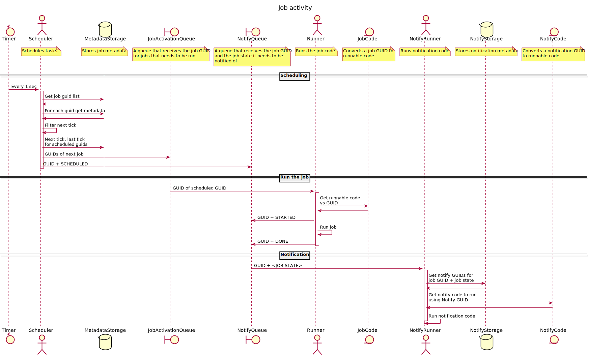
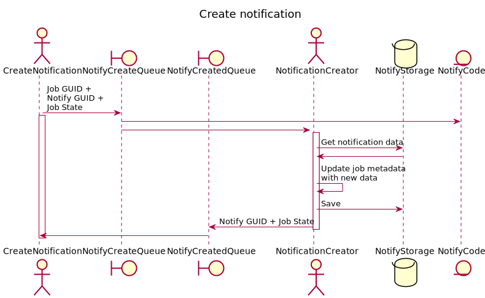
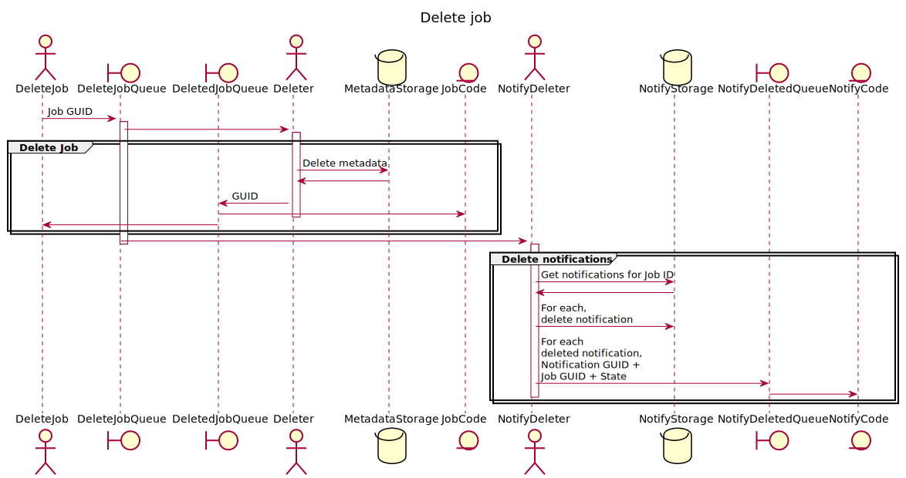
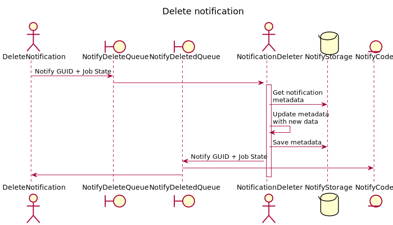

# tokio-cron-scheduler

Use cron-like scheduling in an async tokio environment.
Also schedule tasks at an instant or repeat them at a fixed duration.
Task's data can optionally be persisted using PostgreSQL or Nats.

Inspired by https://github.com/lholden/job_scheduler

[](https://docs.rs/tokio_cron_scheduler) [](https://crates.io/crates/tokio_cron_scheduler) [](https://travis-ci.org/mvniekerk/tokio_cron_scheduler)


## Usage

Please see the [Documentation](https://docs.rs/tokio_cron_scheduler/) for more details.

Be sure to add the job_scheduler crate to your `Cargo.toml`:

```toml
[dependencies]
tokio-cron-scheduler = "*"
```

Creating a schedule for a job is done using the `FromStr` impl for the
`Schedule` type of the [cron](https://github.com/zslayton/cron) library.

The scheduling format is as follows:

```text
sec   min   hour   day of month   month   day of week   year
*     *     *      *              *       *             *
```

Time is specified for `UTC` and not your local timezone. Note that the year may
be omitted.

Comma separated values such as `5,8,10` represent more than one time value. So
for example, a schedule of `0 2,14,26 * * * *` would execute on the 2nd, 14th,
and 26th minute of every hour.

Ranges can be specified with a dash. A schedule of `0 0 * 5-10 * *` would
execute once per hour but only on day 5 through 10 of the month.

Day of the week can be specified as an abbreviation or the full name. A
schedule of `0 0 6 * * Sun,Sat` would execute at 6am on Sunday and Saturday.

Per job you can be notified when the jobs were started, stopped and removed. Because these notifications
are scheduled using tokio::spawn, the order of these are not guaranteed if the task finishes quickly.

A simple usage example:

```rust
use tokio_cron_scheduler::{JobScheduler, JobToRun, Job};

#[tokio::main]
async fn main() {
    let mut sched = JobScheduler::new();
  
    sched.add(Job::new("1/10 * * * * *", |uuid, l| {
        println!("I run every 10 seconds");
    }).await.unwrap());

    sched.add(Job::new_async("1/7 * * * * *", |uuid, mut l| Box::pin( async {
        println!("I run async every 7 seconds");
        let next_tick = l.next_tick_for_job(uuid).await;
        match next_tick {
          Ok(Some(ts)) => info!("Next time for 7s is {:?}", ts),
          _ => warn!("Could not get next tick for 7s job"),
        }
    })).await.unwrap());

    sched.add(Job::new("1/30 * * * * *", |uuid, l| {
        println!("I run every 30 seconds");
    }).await.unwrap());
  
    sched.add(
      Job::new_one_shot(Duration::from_secs(18), |_uuid, _l| {
        println!("{:?} I'm only run once", chrono::Utc::now());
      }).unwrap()
    ).await;

    let mut jj = Job::new_repeated(Duration::from_secs(8), |_uuid, _l| {
      println!("{:?} I'm repeated every 8 seconds", chrono::Utc::now());
    }).unwrap();
  
    jj.on_start_notification_add(&sched, Box::new(|job_id, notification_id, type_of_notification| {
      Box::pin(async move {
        println!("Job {:?} was started, notification {:?} ran ({:?})", job_id, notification_id, type_of_notification);
      })
    })).await;

    jj.on_stop_notification_add(&sched, Box::new(|job_id, notification_id, type_of_notification| {
      Box::pin(async move {
        println!("Job {:?} was completed, notification {:?} ran ({:?})", job_id, notification_id, type_of_notification);
      })
    })).await;
    
    jj.on_removed_notification_add(&sched, Box::new(|job_id, notification_id, type_of_notification| {
      Box::pin(async move {
        println!("Job {:?} was removed, notification {:?} ran ({:?})", job_id, notification_id, type_of_notification);
      })
    })).await;
    sched.add(jj).await;

    let five_s_job = Job::new("1/5 * * * * *", |_uuid, _l| {
      println!("{:?} I run every 5 seconds", chrono::Utc::now());
    })
            .unwrap();
    sched.add(five_s_job).await;
  
    let four_s_job_async = Job::new_async("1/4 * * * * *", |_uuid, _l| Box::pin(async move {
      println!("{:?} I run async every 4 seconds", chrono::Utc::now());
    })).unwrap();
    sched.add(four_s_job_async).await;
  
    sched.add(
      Job::new("1/30 * * * * *", |_uuid, _l| {
        println!("{:?} I run every 30 seconds", chrono::Utc::now());
      })
              .unwrap(),
    ).await;
  
    sched.add(
      Job::new_one_shot(Duration::from_secs(18), |_uuid, _l| {
        println!("{:?} I'm only run once", chrono::Utc::now());
      }).unwrap()
    ).await;
  
    sched.add(
      Job::new_one_shot_async(Duration::from_secs(16), |_uuid, _l| Box::pin( async move {
        println!("{:?} I'm only run once async", chrono::Utc::now());
      })).unwrap()
    ).await;
  
    let jj = Job::new_repeated(Duration::from_secs(8), |_uuid, _l| {
      println!("{:?} I'm repeated every 8 seconds", chrono::Utc::now());
    }).unwrap();
    sched.add(jj).await;
  
    let jja = Job::new_repeated_async(Duration::from_secs(7), |_uuid, _l| Box::pin(async move {
      println!("{:?} I'm repeated async every 7 seconds", chrono::Utc::now());
    })).unwrap();
    sched.add(jja).await;

    #[cfg(feature = "signal")]
    sched.shutdown_on_ctrl_c();

    sched.set_shutdown_handler(Box::new(|| {
      Box::pin(async move {
        println!("Shut down done");
      })
    }));

    sched.start().await;
  
    // Wait a while so that the jobs actually run
    tokio::time::sleep(core::time::Duration::from_secs(100)).await;
}
```

## Similar Libraries

* [job_scheduler](https://github.com/lholden/job_scheduler) The crate that inspired this one
* [cron](https://github.com/zslayton/cron) the cron expression parser we use.
* [schedule-rs](https://github.com/mehcode/schedule-rs) is a similar rust library that implements it's own cron expression parser.

## License

TokioCronScheduler is licensed under either of

* Apache License, Version 2.0, ([LICENSE-APACHE](LICENSE-APACHE) or
  http://www.apache.org/licenses/LICENSE-2.0)
* MIT license ([LICENSE-MIT](LICENSE-MIT) or
  http://opensource.org/licenses/MIT)

## Custom storage
The MetadataStore and NotificationStore traits can be implemented and be used in the JobScheduler. 

A default volatile hashmap based version is provided with the SimpleMetadataStore and SimpleNotificationStore. A persistent version using Nats is provided with NatsMetadataStore and NatsNotificationStore.

## Contributing

Unless you explicitly state otherwise, any contribution intentionally submitted
for inclusion in the work by you, as defined in the Apache-2.0 license, shall
be dual licensed as above, without any additional terms or conditions.

Please see the [CONTRIBUTING](CONTRIBUTING.md) file for more information.

## Features

### has_bytes
Since 0.7

Enables Prost-generated data structures to be used by stores that need to get the bytes
of the data structs. The Nats and Postgres stores depend on this feature being enabled.

### postgres_storage
Since 0.6

Adds the Postgres metadata store, notification store (PostgresMetadataStore, PostgresNotificationStore). Use a Postgres database to store the metadata and notifications data. 

See [PostgreSQL docs](./postgres.md)

### postgres_native_tls
Since 0.6

Uses postgres-native-tls crate as the TLS provider for the PostgreSQL connection.

### postgres_openssl
Since 0.6

Uses the postgres-openssl crate as the TLS provider for the PostgreSQL connection.

### nats_storage
Since 0.6

Adds the Nats metadata store, notification store (NatsMetadataStore, NatsNotificationStore). Use a Nats system as a way to store the metadata and notifications.

See [Nats docs](./nats.md)

### signal
Since 0.5

Adds `shutdown_on_signal` and `shutdown_on_ctrl_c` to the scheduler.
Both shuts the system down (stops the scheduler, removes all the tasks) when a signal
was received.

## Examples

### simple

Runs the in-memory hashmap based storage

```shell
 cargo run --example simple --features="tracing-subscriber"
```

### postgres

Needs a running PostgreSQL instance first:

```shell
docker run --rm -it -p 5432:5432 -e POSTGRES_USER="postgres" -e POSTGRES_PASSWORD="" -e POSTGRES_HOST_AUTH_METHOD="trust" postgres:14.1
```

Then run the example:
```shell
POSTGRES_INIT_METADATA=true POSTGRES_INIT_NOTIFICATIONS=true cargo run --example postgres --features="postgres_storage tracing-subscriber"
```

### nats

Needs a running Nats instance first with Jetream enabled:
```shell
docker run --rm -it -p 4222:4222 -p 6222:6222 -p 7222:7222 -p 8222:8222 nats -js -DV
```

Then run the example:
```shell
cargo run --example nats --features="nats_storage tracing-subscriber"
```

## Design

### Job activity


### Create job


### Create notification


### Delete job


### Delete notification
